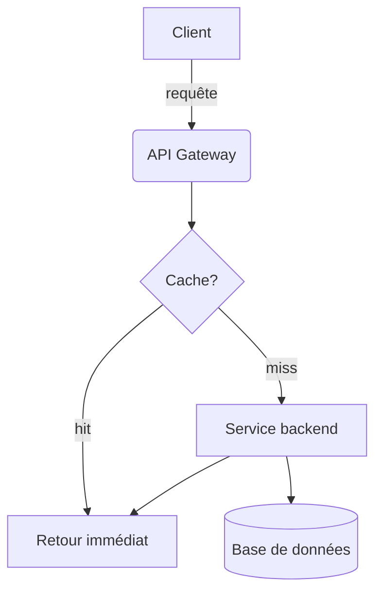

# Exemple de page

Ceci est un paragraphe avec du **gras**, de l'*italique*, du texte ~~barré~~
et du `code inline`. Voici un [lien](https://example.com).

## Diagramme



## Liste de tâches

- [x] Écrire le convertisseur markdown
- [x] Gérer les diagrammes mermaid
- [ ] Tester sur Windows
- [ ] Tester sur macOS

## Tableau

| Composant | Langage | Statut |
|---|:-:|--:|
| Convertisseur | Go | OK |
| Rendu Mermaid | Go + Chrome | OK |
| Client API | Go | OK |

## Image locale


## Code

```go
func main() {
    fmt.Println("hello")
}
```

> Une citation pour vérifier le rendu blockquote.

---

Fin de l'exemple.
