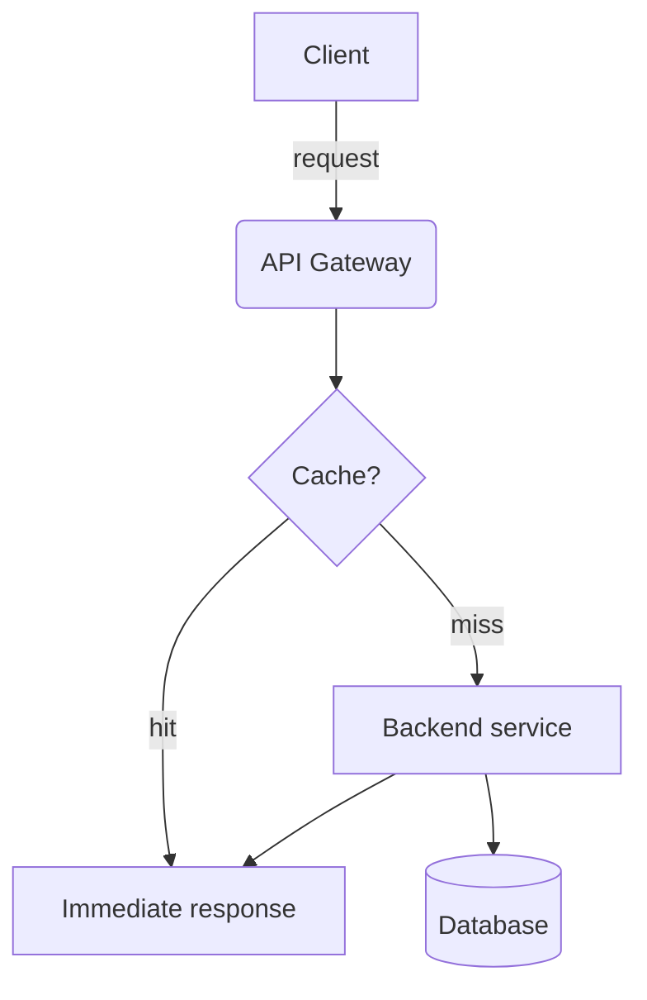

# Example page

This paragraph contains **bold**, *italic*, ~~strikethrough~~, and `inline code` text. Here is a [link](https://example.com).

## Diagram



## Task list

- [x] Write the Markdown converter
- [x] Support Mermaid diagrams
- [x] Test on Windows
- [x] Test on macOS

## Table

| Component | Language | Status |
|---|:-:|--:|
| Converter | Go | OK |
| Mermaid renderer | Go + Chrome | OK |
| API client | Go | OK |

## Local image


## Code

```go
func main() {
    fmt.Println("hello")
}
```

> A quotation used to verify blockquote rendering.

---

End of the example.
